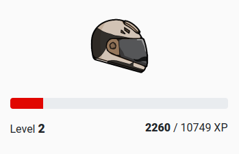

# Level UP

### Experience

From participating and events such as races, you not only get **MParts** as a reward, but you also get experience points! **MExp** for short.

You can see your current **MExp** balance on the dashboard together with your level.

**MExp** is also an ERC20 token! It is a bit special in a way that you don't get to transfer or swap it anywhere. However, it will still show up in your favorite block explorer and other tools.

### Levels

Finally, let's talk about what are the **MExp** actually good for! Based on the number of experience points you collected, you will gain a level. This process works exactly like you are used to in other traditional games.

Higher levels will unlock all of these cool things:

* Bonus on your race rewards
* Higher upgrades for your bike
* More bikes can race at the same time
