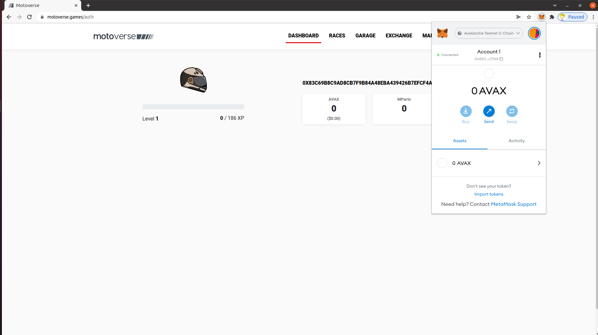

# How to get started

We tried to make the app as simple to use as possible. However, if this is your first interaction with blockchain-enabled applications the learning can be quite challenging.

This page will provide some basic how-to, but **please** do not hesitate to reach out to us on [discord](https://discord.com/invite/mRtPeRNKwn) with any questions or suggestions! We would love to help you out.

### Wallet

In order to store all the cool assets, that you can get on blockchain, you will need a wallet. It is sort of like your bank account on steroids. Some distinctions are:

* One wallet can hold all sorts of coins and NFTs - including our awesome motorbikes!
* You can create it on your device as opposed to a bank


With great power comes great responsibility! Nobody will ever need to know your private key or passphrase! Keep those things secret! There are scammers out there

The only public information is your address that looks like this:\
**0xfc0AfEc13D482EAF36291c7C0278186a4914019D**

They are always the same length and start with **0x.**


To make all our lives easier luckily there is a way to make all that less confusing. There is a trusted plugin called MetaMask that will take care of this for you.&#x20;

Please follow instructions [on Motoverse ](https://motoverse.games/sign)and [MetaMask](https://metamask.io) page on how to install and configure it correctly.

When you are all done you should see a screen like this:

### Avalanche

Motoverse is deployed on [Avalanche](https://docs.avax.network) network/blockchain.

For the testing period, we are live on so called testnet.

In order to interact with Motoverse you will need a bit of AVAX tokens. Because we are on testnet, you get to ask for some for free. To do that, go to the "faucet" and follow the instructions there.

Use your address that is shown in your MetaMask plugin. You can click the **Account 1** header shown in the picture above in order to copy the address.


