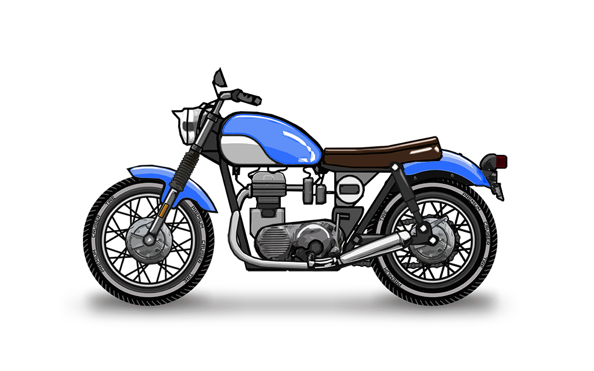

# DeFi

You might be asking where does the profit distributed to the racers comes from. We could just generate our own in game currency MParts and use that as the only reward for the racers similarly to other popular titles in the space.

However, we thought of a better solution in combining gaming with decentralized finance!

### How Does It Work

All the proceeds from bike minting are invested into a stable DeFi interest bearing asset a.k.a. farm.

By playing the game racer gets rewarded in a form of MParts token. We then enable any holder of MParts tokens to exchange them for AVAX tokens in a rate calculated based on the current interest accrued on the global invested pool and the total supply of MParts in existence.

$$
MPartsValue = (Interest / TotalSupply) * MPartsQuantity
$$

To clarify this, let's use an example of this lovely bike.

* _RacerA_ pays **10 AVAX** to gain this motorbike
* Our internal _Treasury_ smart contracts will increase the counter of deposited amount that we call _principal_ from **0** to **10 AVAX**
* _Treasury_ invests **10 AVAX** to a farm with 12% APY.
* _RacerA_ signs up the bike for a race that takes 1 month.
* After that month _RacerA_ claims a reward of **2 MParts**
* There is another _RacerB_ that also claimed the same reward of **2MParts**
* So in total, there are **4 MParts** in existence
* _RacerA_ decides to cash out **2 MParts** and exchange them for **AVAX**
* Our _Treasury_ will do the calculation above where
  * Interest = 0.1 AVAX
  * TotalSupply = 4 MParts
  * MPartsQuantity = 2 MParts

$$
MPartsValue = ( 0.1 / 4 ) *2
$$

* _RacerA_ receives **0.05 AVAX** in exchange for **2 MParts**.
